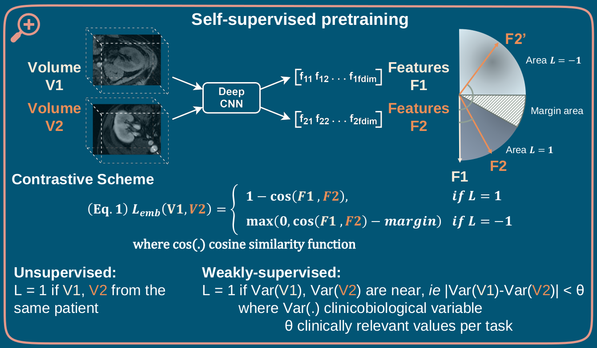
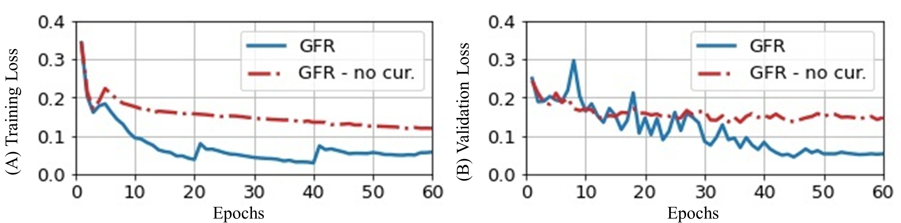

# Renal Transplantation & Medical Imaging project

## Contrastive Learning of Renal Transplant MRIs

<p align="center">
  
</p>

### Usage

Pretrain your ResNet model locally using the dummy dataset with the self-supervised task based on patient level. 
```
python main_train_features.py --target patient --exams D15 D30 M3 M12 --dataset_size 50 --valset_size 10 --architecture resnet18 --img_size 96 144 192 --features_head mlp --feat_dim 256 --batch_size 12 --eval_every 1 --learning_rate 1e-2 --num_epochs 2 4 --warmup_epochs 1 --normalize_feat 1 --augmentation 2 --dropout 0.1 --curriculum 0 1 --loos_margin 0.5 --description dummy_contrastive_cosloss --wandb_id dummy_test
```

Pretrain your ResNet model sending a slurm job (modify ```dataloader.py``` to use your own dataset).  
Edit the file to modify the slurm parameters and/or the ```main_train_features.py``` arguments.
```
python slurm_train_features.py
```

Infer & save the pretrained features for M12 MRIs to csv from your pretrained model.
```
python get_features.py  --exams M12 --architecture resnet18 --pretrained_features_dir ./pretrained_models/dummy_test/dummy_test_best.bin --img_size 96 144 192 --features_head mlp --feat_dim 256 --batch_size 1 --num_epochs 1 --augmentation 0 --description dummy_features
```

### Dummy dataset
As the dataset for this work is not publicly available, I built a dummy mri dataset path tree similar to our dataset so that the code can be ran on it, when argument ```dummy=True``` in ```get_patient_seq_paths``` function.
```bash
├── data
│   ├── dummy_dataframes
│   │   ├── df_targets.csv
│   ├── dummy_mri_dataset (contains patients)
│   │   ├── dummy_mri.nii.gz
│   │   ├── 001-0001-A-A (contains exams)
│   │   │   ├── D15 (contains MRI sequences)
│   │   │   │   ├── 1_WATER_AX_LAVA-Flex_ss_IV
│   │   │   │   ├── 2_WATER_AX_LAVA-Flex_ART
│   │   │   │   ├── 3_WATER_AX_LAVA-Flex_tub
│   │   │   ├── D30
│   │   │   ├── M3
│   │   │   ├── M12
│   │   ├── 001-0002-B-B
│   │   ├── ...
└── ...
```

### Requirements
See conda_environment.yml file or replicate the conda env:
```
conda env create -n ENVNAME --file conda_environment.yml
```

### Curriculum learning
(A) Training and (B) Validation curves for our contrastive learning scheme based on GFR variable with and without curriculum learning.
<p align="center">
  
</p>

### Visualization of features
Generated features from our DCE MRI data visualization using PCA decomposition. Their association with sCreat (&mu;.mol.L<sup>-1</sup>) is depicted, a renal biomarker.
<p align="center">
  
</p>

### Reference
```
@inproceedings{milecki2022constrative,
  title={Constrative Learning for Kidney Transplant Analysis using {MRI} data and Deep Convolutional Networks},
  author={Leo Milecki and Vicky Kalogeiton and Sylvain Bodard and Dany Anglicheau and Jean-Michel Correas and Marc-Olivier Timsit and Maria Vakalopoulou},
  booktitle={Medical Imaging with Deep Learning},
  year={2022},
  url={https://openreview.net/forum?id=fLUyt7-mWwI}
}
```
